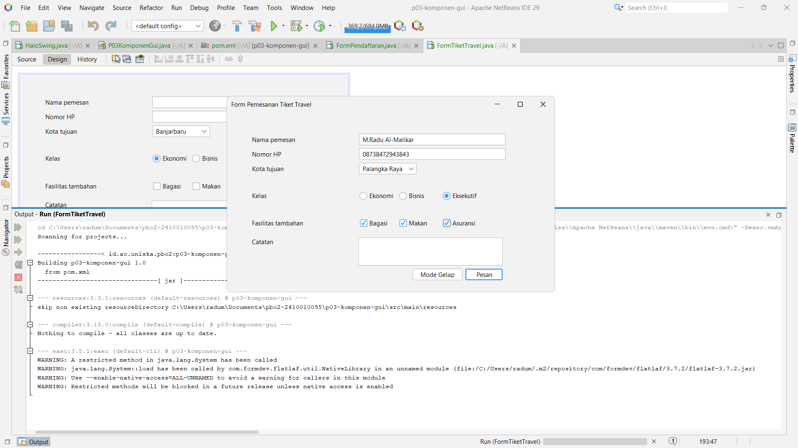
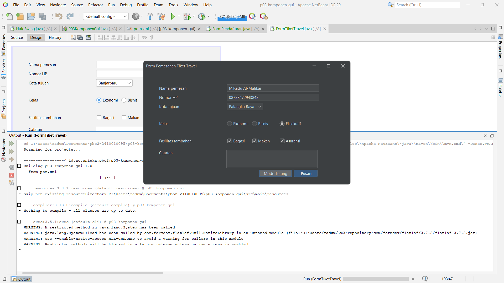

# Tugas 3 - Komponen GUI Swing

**Nama:** M. Radu Al-malikar
**NPM:** 2410010095

### Tema Terang

### Tema Gelap

### Tab Design dengan Navigator

## Pertanyaan Refleksi

**1. Apa perbedaan top-level container, intermediate container, dan atomic component?**
-Top-level container adalah jendela utama yang punya bingkai dan judul. Contoh: JFrame.
-Intermediate container adalah wadah untuk mengelompokkan komponen di dalam jendela. Contoh: JPanel.
-Atomic component adalah komponen yang berinteraksi langsung dengan pengguna. Contoh: JButton.

**2. Mengapa kedua JRadioButton perlu diberi properti buttonGroup yang sama?**
ButtonGroup membuat hanya satu radio button dalam grup yang bisa terpilih. Saat satu dipilih, yang lain otomatis terlepas. Tanpa grup yang sama, setiap radio button berdiri sendiri sehingga keduanya bisa terpilih bersamaan.

**3. Kapan Anda memilih JComboBox dibandingkan JRadioButton?**
JComboBox dipilih ketika pilihannya banyak, karena daftarnya menggulung dan hemat ruang. Contohnya kota tujuan dan program studi. JRadioButton dipilih ketika pilihannya sedikit dan sebaiknya langsung terlihat semua, seperti jenis kelamin atau kelas tiket.

**4. Mengapa kode di dalam initComponents() tidak boleh diedit langsung, dan di mana kode tambahan seharusnya ditulis?**
Isi initComponents() dibuat otomatis oleh NetBeans dari tab Design dan ditulis ulang setiap rancangan berubah, jadi edit manual akan hilang atau merusak sinkronisasi dengan file .form. Kode tambahan ditulis di luar blok abu-abu: di konstruktor setelah initComponents(), di isi event handler, di method bantu, dan di main.

**5. Mengapa FlatLightLaf.setup() harus dipanggil sebelum form dibuat?**
Look and feel dipasang saat komponen dibuat. Kalau setup() dipanggil setelah form jadi, komponen yang sudah ada tetap memakai tampilan lama (Metal), jadi tema FlatLaf tidak terpasang. Karena itu setup() dipanggil dulu di main, baru new FormTiketTravel().